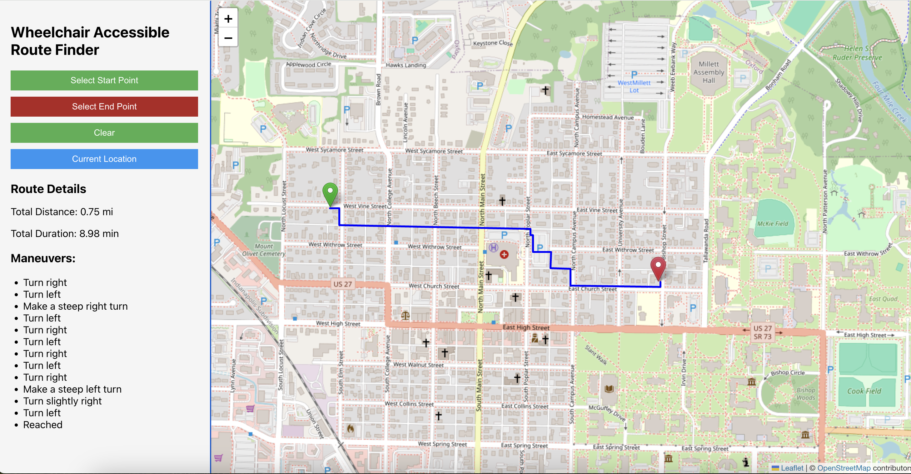

# MyPath Backend

MyPath is a Spring Boot backend that generates wheelchair-accessible navigation routes. It uses **GraphHopper** for routing, **OpenStreetMap (OSM)** PBF map data, and **SRTM elevation data** to produce optimized, barrier-aware paths for wheelchair users.

---

## Features

- **Wheelchair-Optimized Routing** — Custom GraphHopper profile that accounts for surface types, footway classifications, and real-world accessibility constraints.
- **Turn-by-Turn Navigation** — Each route segment includes maneuver instructions (turn left, turn right, slight left, etc.).
- **Surface-Segmented Response** — Route is broken into segments grouped by surface type (asphalt, grass, gravel, etc.).
- **Incline Calculation** — Per-segment incline percentage derived from 3D elevation coordinates.
- **Distance & Duration** — Per-segment distance in feet/miles and estimated travel time based on average wheelchair speed.
- **API Key Authentication** — Bearer token protection on all routing endpoints.
- **Automated Daily Map Updates** — Scheduled job downloads fresh OSM PBF data every day at 1:23 AM and hot-reloads the routing graph without restarting the server.

---

## Sample Route Output

Below is a sample wheelchair-accessible route displayed via a React frontend:



---

## Getting Started

### Prerequisites

| Component       | Version          | Notes                                                                                                    |
|-----------------|------------------|----------------------------------------------------------------------------------------------------------|
| **Java SDK**    | 17 or later      | [Adoptium Temurin 17](https://adoptium.net/en-GB/temurin/releases/?version=17)                          |
| **Gradle**      | 8.7 or compatible | Use the included wrapper (`./gradlew`) — no separate install needed                                     |
| **Spring Boot** | 3.4.3            | Managed via Gradle plugin                                                                                |

### Clone the Repository

```bash
git clone https://github.com/MU-Smart/My-Path-Backend.git
cd mypath
```

### Build

Run the included build script to compile and package the application:

```bash
./build_script.sh
```

This runs `./gradlew clean build bootJar` and produces the JAR at `build/libs/mypath-0.0.1-SNAPSHOT.jar`.

### Start the Server

```bash
./start.sh
```

The server starts on port **8093** and runs in the background. Logs are written to `mypath_stdout.log`.

---

## Configuration

The API key and other settings are configured in `src/main/resources/application.properties`:

```properties
spring.application.name=mypath
api.key=<your-api-key>
```

All requests to `/route/*` require the `Authorization: Bearer <api-key>` header.

---

## API Reference

### Get Wheelchair-Accessible Route

```
GET http://localhost:8093/route/getSingleRoute
```

**Headers**

```
Authorization: Bearer <api-key>
```

**Query Parameters**

| Parameter | Type   | Description              |
|-----------|--------|--------------------------|
| `srcLat`  | double | Source latitude          |
| `srcLon`  | double | Source longitude         |
| `destLat` | double | Destination latitude     |
| `destLon` | double | Destination longitude    |

**Example Request**

```
GET /route/getSingleRoute?srcLat=39.2590641&srcLon=-76.7137842&destLat=39.2586553&destLon=-76.7123601
```

**Response Structure**

```json
{
  "routes": {
    "points": [
      {
        "start_location": { "lat": 39.259, "lon": -76.713, "ele": 50.1 },
        "end_location":   { "lat": 39.258, "lon": -76.712, "ele": 49.5 },
        "points": [
          { "lat": 39.259, "lon": -76.713, "ele": 50.1 },
          { "lat": 39.258, "lon": -76.712, "ele": 49.5 }
        ],
        "surface": "asphalt",
        "distance": { "value": 150.5, "type": "feet", "text": "0.03 mi" },
        "duration": { "value": 20.5, "type": "second", "text": "0.34 min" },
        "maneuver": "Turn right",
        "incline": 1.2
      }
    ]
  }
}
```

Each entry in `points` is a route segment with a uniform surface type. The `maneuver` field at the end of each segment indicates the turn required to enter the next segment. Possible maneuver values:

| Value                  | Meaning                |
|------------------------|------------------------|
| `Go straight`          | Continue straight      |
| `Turn left`            | Standard left turn     |
| `Turn slightly left`   | Gentle left            |
| `Make a steep left turn` | Sharp left           |
| `Turn right`           | Standard right turn    |
| `Turn slightly right`  | Gentle right           |
| `Make a steep right turn` | Sharp right         |
| `Reached`              | Destination reached    |

**Error Responses**

| Status | Condition                                |
|--------|------------------------------------------|
| `401`  | Missing or invalid `Authorization` header |
| `404`  | No accessible route found between points |

---

## Map Data

The routing engine uses OSM PBF files stored in `myPathDataStore/`. The application supports regional extracts for faster startup:

| Region    | Source URL                                                              |
|-----------|-------------------------------------------------------------------------|
| Maryland  | `https://download.geofabrik.de/north-america/us/maryland-latest.osm.pbf` |
| Ohio      | `https://download.geofabrik.de/north-america/us/ohio-latest.osm.pbf`    |
| Wisconsin | `https://download.geofabrik.de/north-america/us/wisconsin-latest.osm.pbf` |
| US (full) | `https://download.geofabrik.de/north-america/us-latest.osm.pbf`         |

The routing graph cache is stored at `myPathDataStore/routing-graph-cache/`.

### Automated Map Updates

A scheduled job runs every day at **1:23 AM** that:
1. Downloads a fresh PBF file from Geofabrik
2. Rebuilds the GraphHopper routing graph into a temporary cache
3. Hot-swaps the active graph without restarting the server
4. Removes old PBF files

---

## Project Structure

```
src/main/java/com/wheelchair/mypath/
├── configurations/     # GraphHopper setup and CORS config
├── constants/          # Shared constants (paths, URLs, thresholds)
├── controller/         # REST controllers (RoutingController)
├── cron/               # Scheduled map update job
├── exceptions/         # Custom exception types
├── exceptionHandler/   # Global exception handler
├── filter/             # API key authentication filter
├── model/              # Domain models and API response types
├── service/            # Routing and navigation logic
└── utils/              # Geo math, string, and date utilities

src/main/resources/
├── application.properties
├── custom-models/
│   └── wheelchair.json     # GraphHopper custom wheelchair routing profile
└── logback-spring.xml
```

---

## Dependencies

| Library                         | Version | Purpose                            |
|---------------------------------|---------|------------------------------------|
| Spring Boot Starter Web         | 3.4.3   | REST API framework                 |
| GraphHopper Core                | 10.2    | Routing engine                     |
| Osmosis Core + PBF              | 0.49.2  | OSM PBF file processing            |
| SLF4J + Logback                 | 2.0/1.5 | Logging                            |